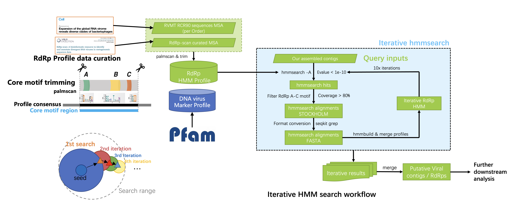

[](https://gitlab.genomics.cn/iori/gvd)  

# Workflow_IterativeHMM_VirusIdentification

   

# Table of Contents

- [Introduction](#Introduction)
- [Installation](#Installation)
- [Usage](#usage)
- [Maintainers](#maintainers)
- [References](#References)
- [Citation](#citation)
- [License](#license)


# Introduction


Previous studies on viral genomes were primarily focused on using BLAST homology searches to identify corresponding marker proteins. However, BLAST's sensitivity is relatively low, making it challenging to discover new viruses. To address this issue, an increasing number of current studies have adopted methods based on Hidden Markov Models (HMMs) to uncover viral marker proteins.

However, this approach still lacks sensitivity when it comes to highly novel viruses or those that are distantly related to known ones. Therefore, in recent years, two articles published in Science and Cell have employed an iterative HMM search method to significantly enhance the sensitivity of virus discovery.

Therefore, this repository has established a workflow based on iterative HMM search. With manually curated both the RdRp-profile used in the Cell article[[1](#ref1)] and RdRp-scan article[[2](#ref2)], as well as the profiles of vertebrate-infecting viral family DNA viral replication-related proteins from Pfam database. These profiles and this workflow is utilized to explore distantly related viruses or distant protein domains. (any protein profile can also be input of the workflow)

# Installation
## Dependencies
### Software
- HMMER
- Seqkit
- CD-HIT
- Python (Required non-Package: pandas, biopython)
- In-house python modules & functions (in `modules/` directory)
> This tool is developed under python 3.8.11

 ### Database (Profiles)
 - dnavirus_full.hmm.gz (replication-associate proteins profile from vertebrate-infecting DNA virus)
 - rdrpscan_full.hmm.gz (RdRp profiles of RdRp-scan; **Faster & lower sensitivity**)
 - rdrpscan_rvmt_fullv2.hmm.gz (integrate RdRp profiles of RVMT and RdRp-scan **very slow & higher sensitivity**)
 > All hmm profiles is compressed in gzip format in `database/` directory, decompress is required for the first time ! ! !


## Linux installation
```bash
$ git clone ssh://git@gitlab.genomics.cn:2200/renzirui/iterativehmmsearch.git
```
# Usage
```bash
$ conda activate /ldfssz1/ST_HEALTH/P20Z10200N0206/P20Z10200N0206_pathogendb/renzirui/miniconda3/envs/viromeworkflow
$ python iterativehmmsearch.py -h 
usage: iterativehmmsearch.py [-h] -q <FASTA> -o <OUTPUT_DIRECTORY> -d <HMM_FILE> [--threads INT] [--evalue FLOAT] [--iteration INT] [--motifcov FLOAT] [--iterstart INT]

optional arguments:
  -h, --help            show this help message and exit
  -q <FASTA>, --query <FASTA>
                        input query orf sequences in FASTA format
  -o <OUTPUT_DIRECTORY>, --output <OUTPUT_DIRECTORY>
                        output and intermediate file directory
  -d <HMM_FILE>, --hmmdb <HMM_FILE>
                        hmm profile of target motif or domain
  --threads INT         threads number assigned in iterative hmmsearch [4]
  --evalue FLOAT        Evalue threshold in iterative hmmsearch [1e-10]
  --iteration INT       Iteration times of hmmsearch [10]
  --motifcov FLOAT      Motif coverage cutoff of hmmsearch results [0.75]
  --iterstart INT       Manually assign start point of iteration for additional iteration or rerun at breakpoint [1]
```
## Input files
- Amino acid sequence(FASTA Format): Predicted & translated amino acid sequence from ORF of viral genome (when using to identify putative viral sequence)
> Amino acid sequence can be generated or predicted using getorf of the EMBOSS software kit, for example:
>
> ```shell
> $ getorf -sequence <INPUT_NUCL> -outseq <OUTPUT_PROT> -find 0 -table 1 -minsize 600
> ```

## Output files

### Output file tree
```bash
$ tree -L 1 output_rna_v1/
output_rna_v1/
├── builded_hmm
│   ├── iter0_full.hmm
│   ├── iter0_full.hmm.h3f
│   ├── iter0_full.hmm.h3i
│   ├── iter0_full.hmm.h3m
│   ├── iter0_full.hmm.h3p
│   ├── iter10_full.hmm
│   ├── iter1_full.hmm
│   ├── iter1_full.hmm.h3f
│   ├── iter1_full.hmm.h3i
│   ├── iter1_full.hmm.h3m
│   ├── iter1_full.hmm.h3p
│ 	...
├── Iteration_1
│   ├── cluster
│   ├── hmmbuild
│   ├── hmmbuild_MSA
│   ├── hmmsearch.aln
│   ├── hmmsearch.domtblout
│   ├── hmmsearch.tblout
│   ├── profile_covstat.tsv
│   └── sto2fas
├── Iteration_10
├── Iteration_2
├── Iteration_3
├── Iteration_4
├── Iteration_5
├── Iteration_6
├── Iteration_7
├── Iteration_8
├── Iteration_9
└── cleaned.inputsequence.faa

11 directories, 1 file
```


### File specification


## Running test
Demo input file and correspondent output file is located in `testdata/` directory, script is saved in `testdata/run_test.sh`

Below is a terminal snapshot for reference:

```bash
$ getorf -find 0 -table 1 -minsize 600 -sequence <(zcat metatranscriptomic_assembly.fna.gz) -outseq metatranscriptomic_assembly.faa
Find and extract open reading frames (ORFs)

$ python ../iterativehmmsearch.py -q metatranscriptomic_assembly.getorf.faa -o test_rna_out -d rdrpscan_full.hmm --threads 24
IterativeHMM_Searcher v0.2a

Author:Zirui Ren <renzirui@genomics.cn>

###  alpha version  ###

===================================
       Search Configurations
———————————————————————————————————
        Query : metatranscriptomic_assembly.getorf.faa
       Output : test_rna_out
        HMMdb : rdrpscan_full.hmm
      Threads : 24
 IterationNum : 10
     MotifCov : 0.75
    IterStart : 1
===================================
[INFO] Output directory created
14:22:39   [INFO] sequence header cleanup done
-----------------------Iterative_hmmsearch-------------------------
##Iteration 1
14:22:39   [INFO] hmmpress done (Time Elapsed: 0.068s)
14:22:39   [INFO] HMM search iteration 1 running...
14:22:54   [INFO] hmmsearch done, 2565 sequences hit (Time Elapsed: 14.589s)
14:22:54   [INFO] Successfully read STOCKHOLM MSA of 32 profiles
14:22:54   [INFO] Converted 32 records from STOCKHOLM format to FASTA (Time Elapsed: 0.483s)
14:22:59   [INFO] 2179 sequences covered >75% RdRp motif region (Time Elapsed: 4.941s)
14:23:01   [INFO] 2179 sequences from 25 profiles after filtering written to FASTA (Time Elapsed: 2.412s)
14:23:01   [INFO] cd-hit clustering profile 25 of 25 (100%)
14:23:06   [INFO] cd-hit done (Time Elapsed: 4.210s)
14:23:08   [INFO] 1244 MSA seqs for 25 profiles fetched (Time Elapsed: 2.570s)
14:23:08   [INFO] hmmbuild running on profile 25 of 25 (100%)
14:23:13   [INFO] Full iterative hmm file written to test_rna_out/builded_hmm/iter1_full.hmm
14:23:13   [INFO] hmmbuild done (Time Elapsed: 5.255s)
14:23:13   [INFO] Iteration 1 finished (Time Elapsed: 34.460s)
...
```
Any question or bug and also suggestions when executing this workflow are welcomed to create a issue here:

 [Issues · IORI / GPD / Workflow_IterativeHMM_VirusIdentification · GitLab (genomics.cn)](https://gitlab.genomics.cn/iori/gvd/Workflow_IterativeHMM_VirusIdentification/-/issues)


# Maintainers

[任梓睿](https://gitlab.genomics.cn/renzirui)

# References

1. <a name="ref1"></a>Neri U, Wolf YI, Roux S, Camargo AP, Lee B, Kazlauskas D, et al. Expansion of the global RNA virome reveals diverse clades of bacteriophages. Cell. 2022 Oct;185(21):4023-4037.e18. (DOI:[10.1016/j.cell.2022.08.023](https://doi.org/10.1016/j.cell.2022.08.023))
2. <a name="ref2"></a>Charon, Justine, et al. "RdRp-scan: A bioinformatic resource to identify and annotate divergent RNA viruses in metagenomic sequence data." *Virus Evolution* 8.2 (2022): veac082. (DOI:[10.1093/ve/veac082](https://doi.org/10.1093/ve/veac082))

# License

NA

# Citation

NA
